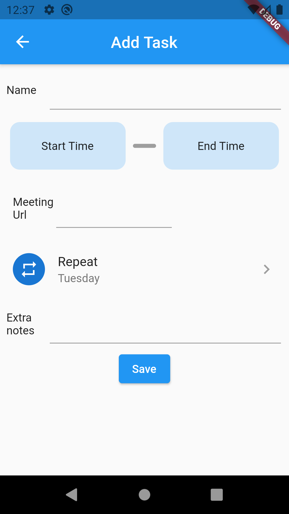
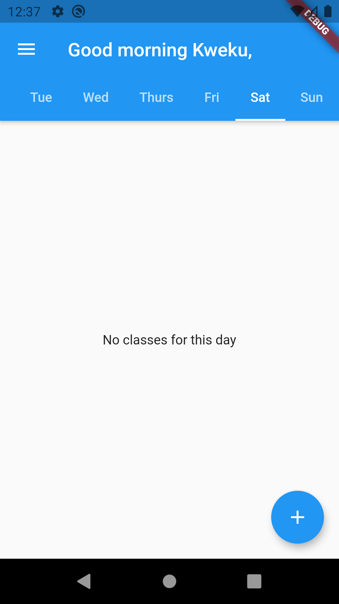
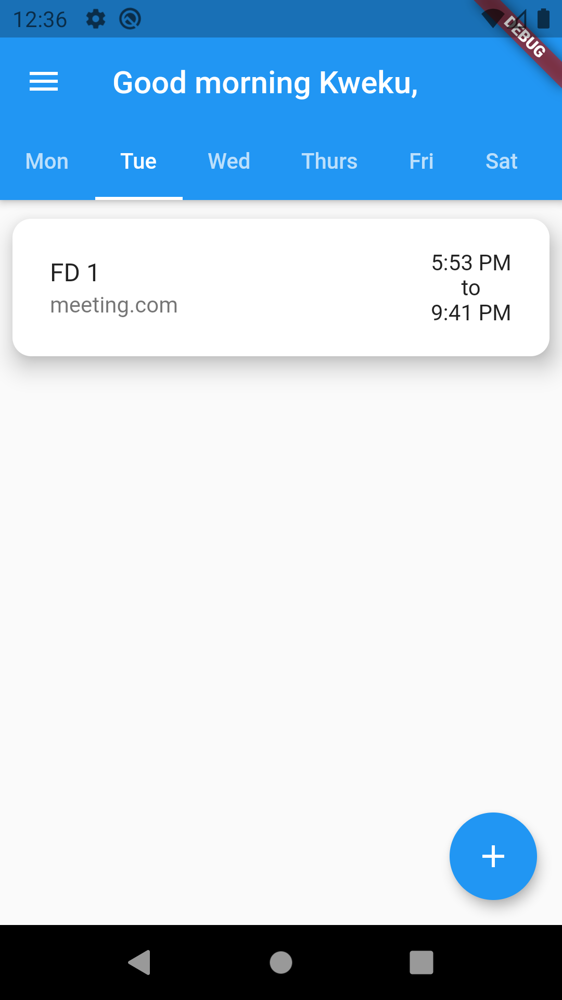
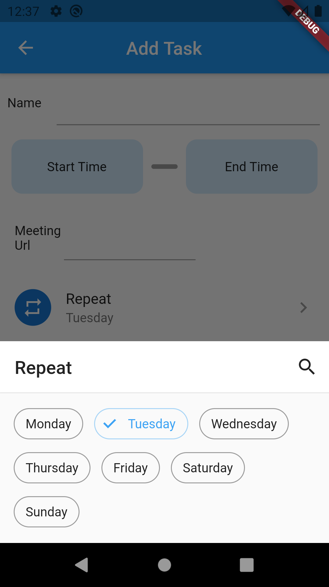
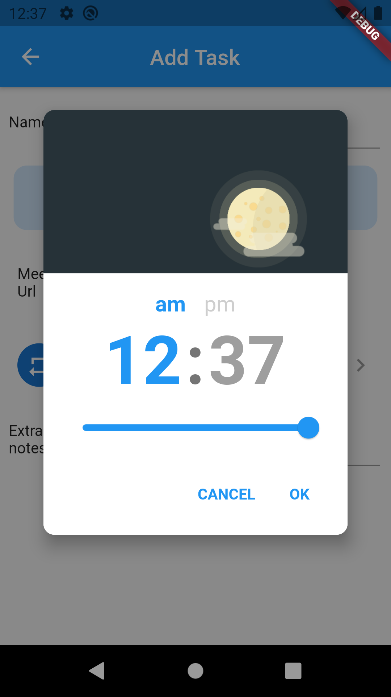

# where_and_when

Where and When is a mobile application that allows students to set reminders for their classes. Because it is difficult to remember and easily access the zoom meeting urls for each class, Where and When allows students to attach the urls to each class listing, giving quick access to each classes' link.
Future implementations will be added to allow students compare class schedules with group members to find times where each member is likely to be available for group meetings

    
   

